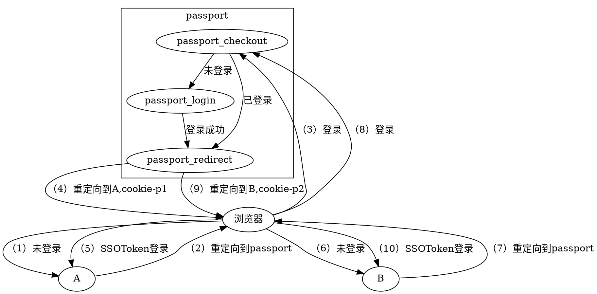

```dot
digraph sso{
    subgraph cluster_passport {
        label = "passport"
        passport_checkout -> passport_login [label = "未登录"] 
        passport_login -> passport_redirect [label = "登录成功"] 
        passport_checkout -> passport_redirect [label = "已登录"] 
    }

    浏览器 -> A [label = "（1）未登录"]
    A -> 浏览器 [label = "（2）重定向到passport"]
    浏览器 -> passport_checkout [label = "（3）登录"]
    passport_redirect -> 浏览器 [label = "（4）重定向到A,cookie-p1"]
    浏览器 -> A [label = "（5）SSOToken登录"]

    浏览器 -> B [label = "（6）未登录"]
    B -> 浏览器 [label = "（7）重定向到passport"]
    浏览器 -> passport_checkout [label = "（8）登录"]
    passport_redirect -> 浏览器 [label = "（9）重定向到B,cookie-p2"]
    浏览器 -> B [label = "（10）SSOToken登录"]
}

```

  