# gc日志参数建议
```shell
-verbose:class 
-XX:+PrintCommandLineFlags 
-XX:+PrintGCDetails 
-XX:+PrintGCDateStamps 
-XX:+PrintClassHistogramBeforeFullGC 
-XX:+PrintClassHistogramAfterFullGC 
-XX:+PrintGCApplicationConcurrentTime 
-XX:+PrintGCApplicationStoppedTime 
-XX:+PrintTenuringDistribution 
-XX:+PrintHeapAtGC 
-Xloggc:/data/files/tmp/foo/gc.log 
-XX:+HeapDumpOnOutOfMemoryError 
-XX:HeapDumpPath=/data/files/tmp/foo
-XX:ErrorFile=/data/files/tmp/foo/hs_err_pid%p.log 
```

# -verbose:class    
- _这个选项打印内容可能有点多，考虑作为可选项_
- Tracing Class Load And Unload
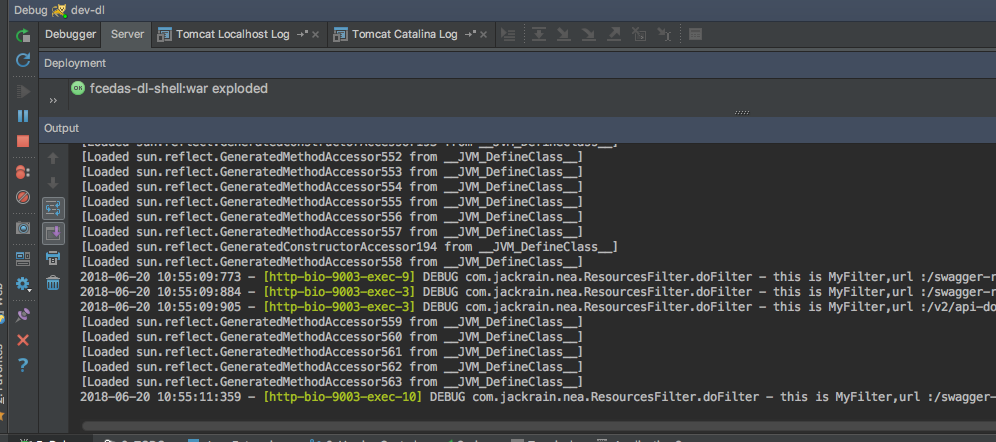

# -XX:+PrintCommandLineFlags
- Print flags specified on command line or set by ergonomics
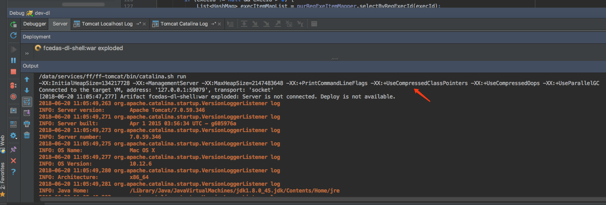
- 扩展参数：-XX:+PrintFlagsFinal 
    - _这个选项打印内容可能有点多，考虑作为可选项_
    - Print all VM flags after argument and ergonomic processing
    ```
    表格的每一行包括五列，来表示一个XX参数。第一列表示参数的数据类型，第二列是名称，第四列为值，第五列是参数的类别。第三列”=”表示第四列是参数的默认值，而”:=” 表明了参数被用户或者JVM赋值了。
    ```
    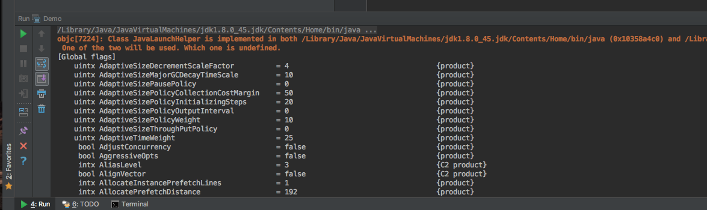

# -XX:+PrintGCDetails
- Print more details at garbage collection
- 这个打印的内容比-verbose:gc 更详细
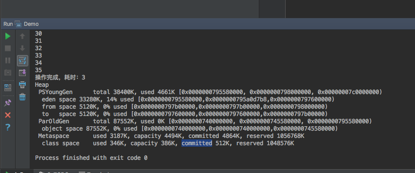

# -XX:+PrintGCDateStamps 
- Print date stamps at garbage collection
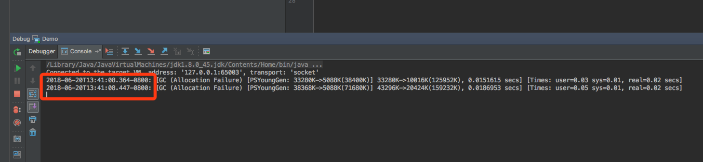

# -XX:+PrintClassHistogramBeforeFullGC
- _这个选项打印内容可能有点多，考虑作为可选项_
- Print a class histogram before any major stop-world GC
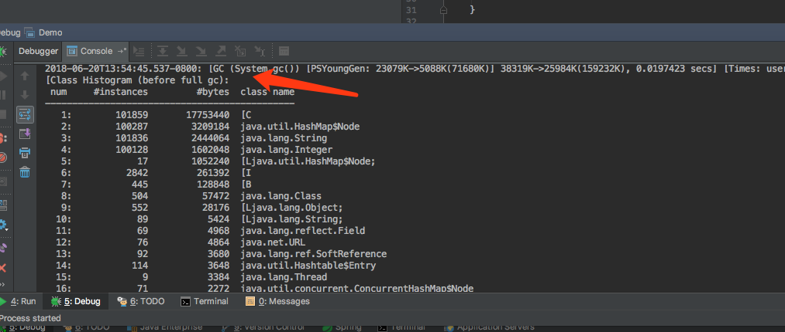

# -XX:+PrintClassHistogramAfterFullGC
- _这个选项打印内容可能有点多，考虑作为可选项_
- Print a class histogram after any major stop-world GC
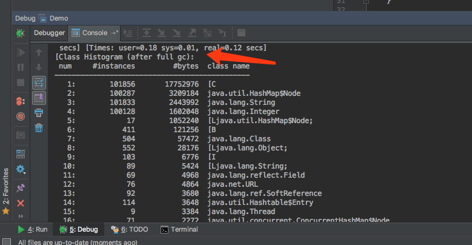

# -XX:+PrintGCApplicationConcurrentTime
- Print the time the application has been running
- 打印每次垃圾回收前,程序未中断的执行时间。
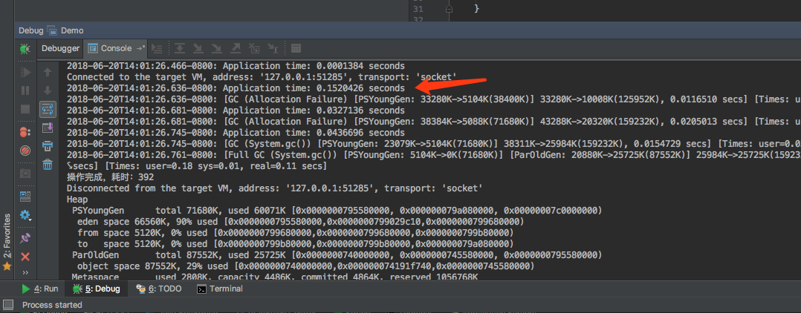

# -XX:+PrintGCApplicationStoppedTime
- Print the time the application has been stopped
- 打印垃圾回收期间程序暂停的时间。
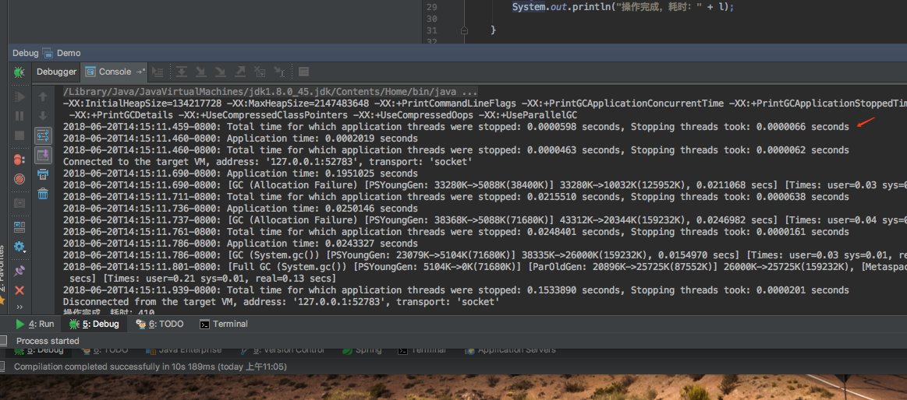

# -XX:+PrintTenuringDistribution
- Print tenuring age information
- 指定JVM 在每次新生代GC时，输出幸存区中对象的年龄分布。
- 可以用来收集年龄分布数据，为-XX:MaxTenuringThreshold参数的调优提供参考。
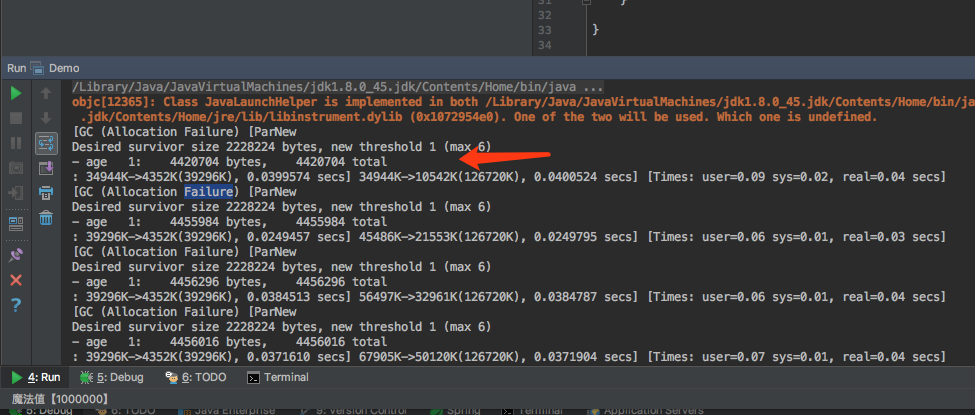

# -XX:+PrintHeapAtGC
- Print heap layout before and after each GC
- 在进行GC的前后打印出堆的信息
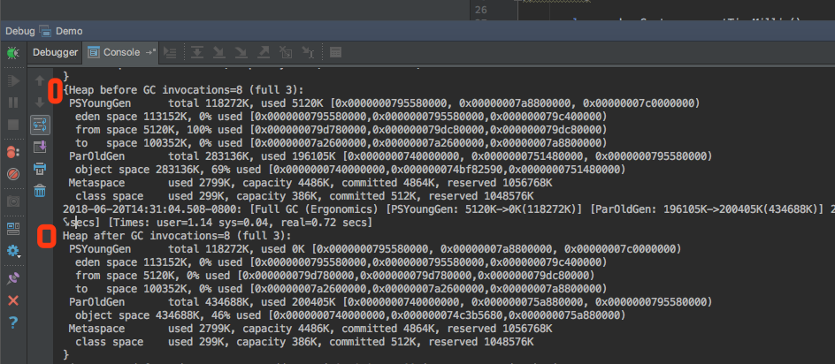


# -Xloggc:/home/app/foo/gc.log 
- GC Log File Path

# -XX:+HeapDumpOnOutOfMemoryError 
- Dump heap to file when java.lang.OutOfMemoryError is thrown

# -XX:HeapDumpPath=/home/app/foo 
- When HeapDumpOnOutOfMemoryError is on, the path (filename or directory) of the dump file (defaults to java_pid<pid>.hprof in the working directory)

# -XX:ErrorFile=/home/app/foo/hs_err_pid%p.log
- If an error occurs, save the error data to this file [default: ./hs_err_pid%p.log] (%p replaced with pid)