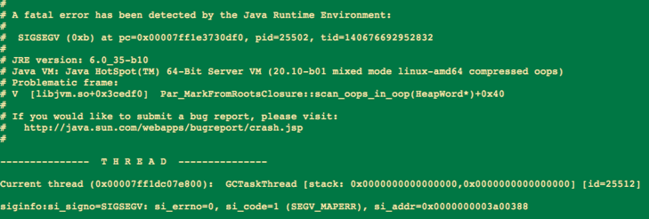
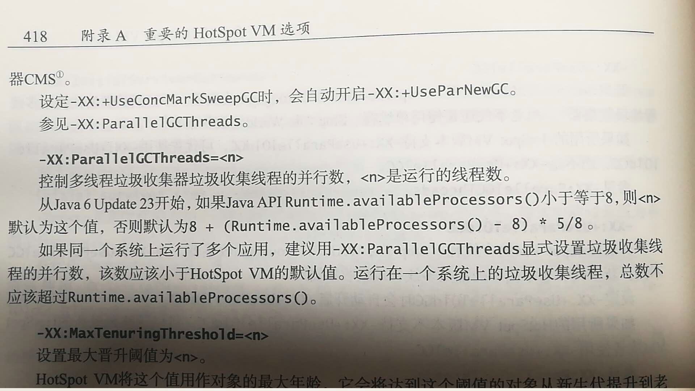

1 问题描述     
      某服务有两台机器，每隔几天会报警load高，一开始看监控发现gc时间抖动很大，以为是发生了fullgc引起卡顿而未加注意，之后登入线上机器查看日志发现是jvm崩溃导致了服务重启从而引发gc时间抖动。以某天为例，该服务分别在上午7点和上午10点发生jvm崩溃，如果同时发生崩溃将导致线上停服，后果不堪设想。

2 问题分析
     崩溃日志显示jvm崩溃发生在在标记清除扫根路径时。

     搜索此bug，发现是jvm的一个已知bug，https://bugs.openjdk.java.net/browse/JDK-8020236，这个bug在1.6和1.7中均有，只是因为重现困难而一直未被修复。

                Par_MarkFromRootsClosure::scan_oops_in_oop(HeapWord*)

 

      有人遇到和我们一样的问题（http://hllvm.group.iteye.com/group/topic/43404），他通过压测发现当“ParallelCMSThreads > ParallelGCThreads”会引起此崩溃，而当"ParallelCMSThreads <= ParallelGCThreads"时问题不再复现。而“ParallelCMSThreads > ParallelGCThreads”这个问题也在jvm bug列表中（https://bugs.openjdk.java.net/browse/JDK-6668573），此bug下有人给出的解决思路是将ParallelCMSThreads 设置为 <=ParallelGCThreads。

3 解决方法
        查看我们junglepoi-service服务的jvm参数配置，发现ParallelCMSThreads被设置成4，而ParallelGCThreads却未被设置。默认情况下ParallelGCThreads = (ncpus <= 8) ? ncpus : 3 + ((ncpus * 5) / 8)，其中ncpus是机器的核数，由于junglepoi-service服务所在的机器为2核4G配置，因此默认情况下ParallelGCThreads=2，此时ParallelCMSThreads > ParallelGCThreads。       

       解决方法是：1）将ParallelCMSThreads设置为2或1；2）或者不设置ParallelCMSThreads，默认情况下ParallelCMSThreads = (ParallelGCThreads + 3) / 4，如果不设置默认ParallelCMSThreads=(2+3)/4=1。

       我们将ParallelCMSThreads设置为2，上线两天未复现jvm崩溃异常，后续将持续观察。

4 启示
       不能简单拷贝其它项目的jvm参数配置，需要结合项目特点、机器环境等各方面信息来综合配置。

转载请标明源地址：http://www.cnblogs.com/LBSer