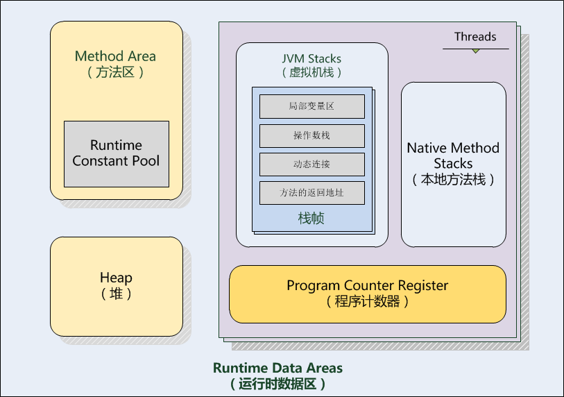
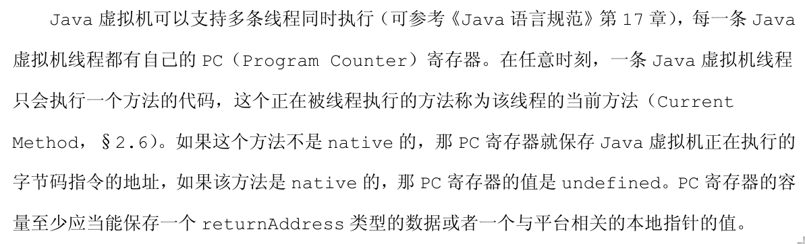

# PC 寄存器
## 每一条JAVA虚拟机线程都有自己的PC寄存器
- 这里的PC寄存器与CS:IP寄存器的关系？
- 生命周期与线程一致？
## 保存JAVA虚拟机正在执行的指令地址
- 非native，字节码地址
- native，undefined
- PC值实际上就是指向方法区(Method Area)中的内存地址？



# JAVA虚拟机栈
## 与线程一起创建
    - 生命周期与线程相同？
## 存储栈帧
    - 局部变量表
    - 操作数栈
    - 动态链接
## 待考证资料
每个栈空间的默认大小为0.5M，在1.7里调整为1M，每调用一次方法就会压入一个栈帧，如果压入的栈帧深度过大，即方法调用层次过深,就会抛出StackOverFlow,，SOF最常见的场景就是递归中，当递归没办法退出时，就会抛此异常，Hotspot提供了参数设置改区域的大小，使用-Xss：xxK，就可以修改默认大小。

# JAVA堆
## 几乎所有对象实例和数组都在堆中存放
```
    - [虚拟机规范原文] The heap is the runtime data area from which memory for all class instances and arrays is allocated. "jvm的heap是被所有jvm线程共享的一块区域。所有的类实例和数组都是在heap中分配内存。"
```
- 优化技术个例
    - 栈上分配
    - 标量替换

## 分代
- 新生代
    - Eden
    - From
    - To
- 老年代

- 永久代(1.6)
    - JVM中类的元数据在Java堆中的存储区域。
    - Java类对应的HotSpot虚拟机中的内部表示也存储在这里。
    - 类的层级信息，字段，名字。
    - 方法的编译信息及字节码。
    - 变量
    - 常量池和符号解析

- 永久代(1.7)
    - 字符串常量池被移到堆中
```
    Area: HotSpot
    Standard/Platform: JDK 7
    Synopsis: In JDK 7, interned strings are no longer allocated in the permanent generation of the Java heap, but are instead allocated in the main part of the Java heap (known as the young and old generations), along with the other objects created by the application. This change will result in more data residing in the main Java heap, and lessw data in the permanent generation, and thus may require heap sizes to be adjusted. Most applications will see only relatively small differences in heap usage due to this change, but larger applications that load many classes or make heavy use of the String.intern() method will see more significant differences.
    RFE: 6962931
```

- Meta Space(1.8)

# 方法区
- 方法区是jvm规范的叫法，永久代是hotspot实现中的叫法

## 运行时常量池
- RednaxelaFX的解释
```
    可以理解为：class文件常量池只是.class文件中的、静态的；而运行时常量池，是在运行时将所有class文件常量池中的东西加载进来？

    运行时常量池是把Class文件常量池加载进来，每个类有一个独立的。刚开始运行时常量池里的链接都是符号链接，跟在Class文件里一样；边运行边就会把用到的常量转换成直接链接，例如说要Class A调用Foo.bar()方法，A.class文件里就会有对该方法的Methodref常量，是个符号链接（只有名字没有实体），加载到运行时常量池也还是一样是符号链接，等真的要调用该方法的时候该常量就会被resolve为一个直接链接（直接指向要调用的方法的实体）。
```

# 本地方法栈
- 用于native方法
