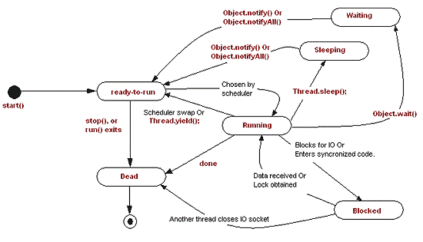
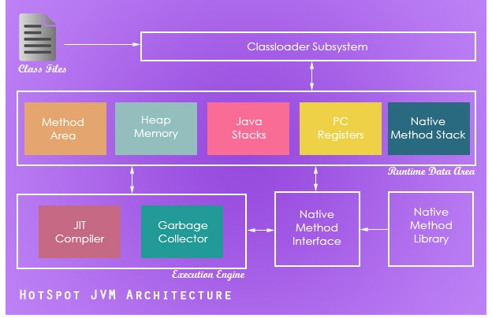
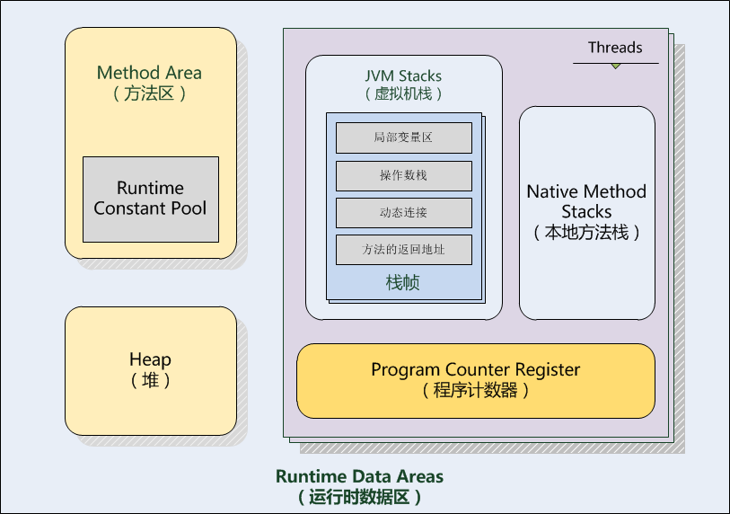
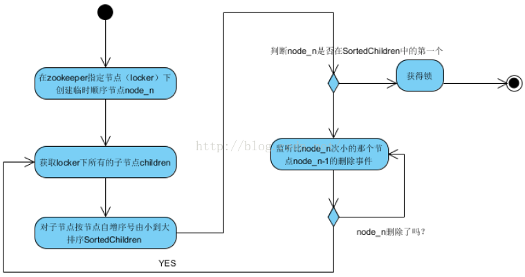
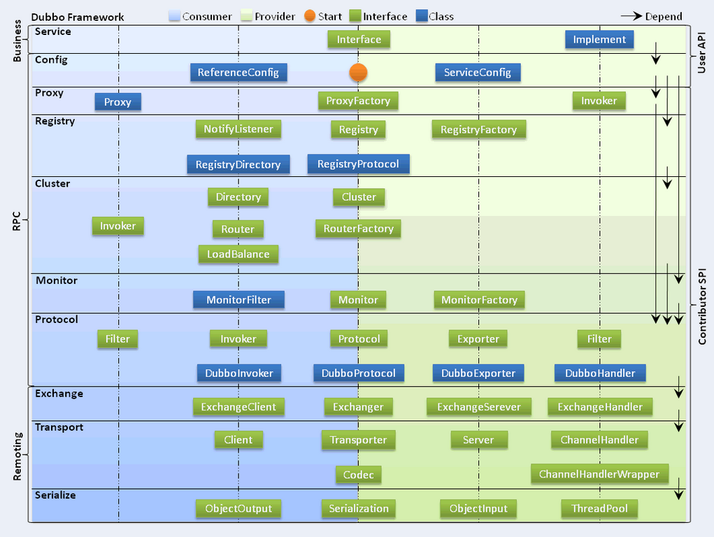
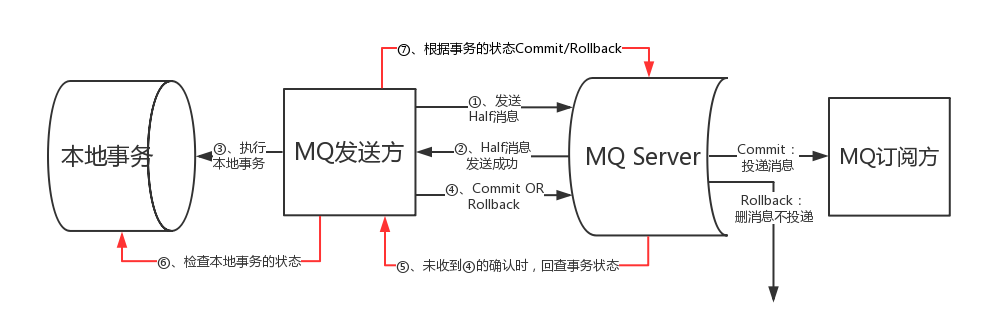
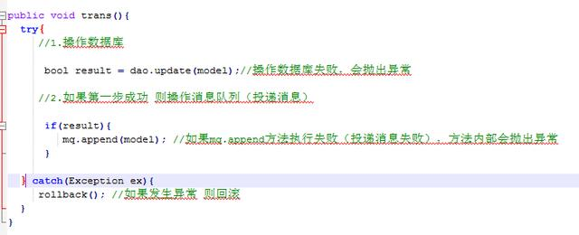

<!-- TOC -->

- [1. TODO](#1-todo)
- [2. 项目](#2-项目)
    - [2.1. 项目介绍](#21-项目介绍)
        - [2.1.1. SSO](#211-sso)
        - [2.1.2. 事件总线](#212-事件总线)
        - [2.1.3. Gateway](#213-gateway)
        - [2.1.4. redis秒杀实现](#214-redis秒杀实现)
        - [2.1.5. 基础框架项目](#215-基础框架项目)
            - [2.1.5.1. 调用链](#2151-调用链)
            - [2.1.5.2. 国际化](#2152-国际化)
            - [2.1.5.3. JSON序列化List问题优化](#2153-json序列化list问题优化)
            - [2.1.5.4. AOP事件探针方案](#2154-aop事件探针方案)
            - [2.1.5.5. maven archetype](#2155-maven-archetype)
        - [2.1.6. 服务化改造类项目经验总结](#216-服务化改造类项目经验总结)
    - [2.2. 项目过程相关技能](#22-项目过程相关技能)
        - [2.2.1. git](#221-git)
            - [2.2.1.1. 原理](#2211-原理)
            - [2.2.1.2. 常用命令](#2212-常用命令)
            - [2.2.1.3. 分支模型](#2213-分支模型)
        - [2.2.2. maven](#222-maven)
            - [2.2.2.1. 原理](#2221-原理)
            - [2.2.2.2. 生命周期](#2222-生命周期)
            - [2.2.2.3. 常用插件](#2223-常用插件)
        - [2.2.3. 单元测试](#223-单元测试)
            - [2.2.3.1. junit](#2231-junit)
            - [2.2.3.2. 嵌入式数据库](#2232-嵌入式数据库)
            - [2.2.3.3. mockito](#2233-mockito)
        - [2.2.4. linux开发环境](#224-linux开发环境)
- [3. JAVA Language Specification](#3-java-language-specification)
    - [3.1. 语法](#31-语法)
    - [3.2. 词法结构](#32-词法结构)
    - [3.3. 类型、值和变量](#33-类型值和变量)
    - [3.4. 类型转换与上下文](#34-类型转换与上下文)
    - [3.5. 命名](#35-命名)
    - [3.6. 包](#36-包)
        - [3.6.1. 包结构概述](#361-包结构概述)
    - [3.7. 类](#37-类)
    - [3.8. 接口](#38-接口)
    - [3.9. 数组](#39-数组)
    - [3.10. 异常](#310-异常)
    - [3.11. JAVA内存模型](#311-java内存模型)
        - [3.11.1. 什么是内存模型（个人理解）](#3111-什么是内存模型个人理解)
        - [3.11.2. 重排序](#3112-重排序)
            - [3.11.2.1. 编译器重排序](#31121-编译器重排序)
            - [3.11.2.2. CPU重排序](#31122-cpu重排序)
        - [3.11.3. happens-before](#3113-happens-before)
        - [3.11.4. final](#3114-final)
        - [3.11.5. double和long的非原子性处理](#3115-double和long的非原子性处理)
        - [3.11.6. wait集、通知](#3116-wait集通知)
        - [3.11.7. wait、sleep、yield、join](#3117-waitsleepyieldjoin)
    - [3.12. OTHER](#312-other)
        - [3.12.1. StringBuilder StringBuffer](#3121-stringbuilder-stringbuffer)
        - [3.12.2. NIO](#3122-nio)
            - [3.12.2.1. 实现原理](#31221-实现原理)
            - [3.12.2.2. 基本概念](#31222-基本概念)
        - [3.12.3. 代理](#3123-代理)
        - [3.12.4. 注解](#3124-注解)
        - [3.12.5. 集合](#3125-集合)
            - [3.12.5.1. HashMap](#31251-hashmap)
            - [3.12.5.2. concurrentHashMap](#31252-concurrenthashmap)
        - [3.12.6. 线程](#3126-线程)
        - [3.12.7. 锁](#3127-锁)
- [4. JVM](#4-jvm)
    - [4.1. 类加载器](#41-类加载器)
    - [4.2. 运行时数据区](#42-运行时数据区)
        - [4.2.1. PC寄存器](#421-pc寄存器)
        - [4.2.2. 虚拟机线程栈](#422-虚拟机线程栈)
        - [4.2.3. 本地方法栈](#423-本地方法栈)
        - [4.2.4. 堆](#424-堆)
            - [4.2.4.1. TLAB](#4241-tlab)
            - [4.2.4.2. 对象进入老年代的时机](#4242-对象进入老年代的时机)
        - [4.2.5. 方法区（永久代）](#425-方法区永久代)
    - [4.3. 执行子系统](#43-执行子系统)
    - [4.4. GC算法](#44-gc算法)
        - [4.4.1. 分类](#441-分类)
        - [4.4.2. GC算法案例](#442-gc算法案例)
    - [4.5. 性能优化](#45-性能优化)
    - [4.6. 常用参数](#46-常用参数)
        - [4.6.1. 参数分类](#461-参数分类)
    - [4.7. 踩坑记录](#47-踩坑记录)
- [5. 数据结构&算法](#5-数据结构算法)
    - [5.1. hash算法](#51-hash算法)
- [6. 常用框架](#6-常用框架)
    - [6.1. Servlet](#61-servlet)
    - [6.2. spring mvc](#62-spring-mvc)
    - [6.3. spring](#63-spring)
        - [6.3.1. 骨骼架构](#631-骨骼架构)
        - [6.3.2. Ioc](#632-ioc)
        - [6.3.4. spring 事务](#634-spring-事务)
        - [6.3.5. Spring生命周期](#635-spring生命周期)
        - [6.3.6. 用到的设计模式](#636-用到的设计模式)
    - [6.4. mybatis](#64-mybatis)
    - [6.5. shiro](#65-shiro)
    - [6.6. quartz](#66-quartz)
    - [6.7. spring boot](#67-spring-boot)
- [7. 中间件](#7-中间件)
    - [7.1. nginx](#71-nginx)
    - [7.2. tomcat](#72-tomcat)
    - [7.3. rabbitMq](#73-rabbitmq)
    - [7.4. zookeeper](#74-zookeeper)
- [8. 数据库](#8-数据库)
    - [8.1. mysql](#81-mysql)
    - [8.2. redis](#82-redis)
        - [8.2.1. 数据结构](#821-数据结构)
    - [8.3. mongo](#83-mongo)
- [9. 服务化技术栈](#9-服务化技术栈)
    - [9.1. Dubbo](#91-dubbo)
    - [9.2. spring cloud](#92-spring-cloud)
    - [9.3. Service Mesh](#93-service-mesh)
- [10. 理论](#10-理论)
    - [10.1. 面向对象](#101-面向对象)
        - [10.1.1. 封装](#1011-封装)
        - [10.1.2. 继承](#1012-继承)
        - [10.1.3. 多态](#1013-多态)
        - [10.1.4. 基本设计原则SOLID](#1014-基本设计原则solid)
        - [10.3.2. ACID](#1032-acid)
    - [10.4. 服务化](#104-服务化)
        - [10.4.1. 服务拆分](#1041-服务拆分)
        - [10.4.2. 服务治理](#1042-服务治理)
        - [10.4.3. 分布式事务](#1043-分布式事务)
            - [10.4.3.1. 两阶段提交](#10431-两阶段提交)
            - [10.4.3.2. 三阶段提交](#10432-三阶段提交)
            - [10.4.3.3. tcc](#10433-tcc)
            - [10.4.3.4. xa](#10434-xa)
            - [10.4.3.5. mq最终一致性](#10435-mq最终一致性)
- [11. 协议&规范](#11-协议规范)
    - [11.1. http协议](#111-http协议)
        - [11.1.1. cookie](#1111-cookie)
        - [11.1.2. session](#1112-session)
        - [11.1.3. status code](#1113-status-code)
    - [11.2. TCP](#112-tcp)
    - [11.3. UDP](#113-udp)
    - [11.4. OAuth](#114-oauth)
    - [11.5. EL](#115-el)
- [12. 常用参考资料](#12-常用参考资料)

<!-- /TOC -->
# 1. TODO
- 分布式事务细节
- mq事务消息
- spring boot starter 自动配置原理
- redis事务原理
- redis watch原理
- rpc框架
- https://segmentfault.com/a/1190000003063859
- https://www.aliyun.com/jiaocheng/136191.html?spm=5176.100033.1.17.8ijJj4
- https://www.oschina.net/news/94593/t-io-2-1-0-released
- https://www.cnblogs.com/wulq/p/6792716.html
- https://blog.csdn.net/ccfxue/article/details/53822740
- http://www.spring4all.com/article/320

# 2. 项目
## 2.1. 项目介绍
### 2.1.1. SSO
- 利用cookie解决跨域身份识别
- sdk封装思路
- 安全风险分析

### 2.1.2. 事件总线
- redis pub-sub 实现消息订阅
- redis list 做队列，实现事件日志采集

### 2.1.3. Gateway
- dsl
- js
- el解析规范
- vfs

### 2.1.4. redis秒杀实现
- 整体思路
```
    Redis Watch 命令用于监视一个(或多个) key ，如果在事务执行之前这个(或这些) key 被其他命令所改动，那么事务将被打断
```
- watch流程
- watch实现原理

### 2.1.5. 基础框架项目
#### 2.1.5.1. 调用链
- Threadlocal
- RPC隐式传参
- logback扩展
#### 2.1.5.2. 国际化
#### 2.1.5.3. JSON序列化List问题优化
- TypeReferenceWrapper解决泛型的类型擦除问题，对序列化框架做一层浅封装
- code template
- 泛型擦除问题分析
#### 2.1.5.4. AOP事件探针方案
- annotation
- aop
- threadlocalTraceId
#### 2.1.5.5. maven archetype
- 生成骨架
- 生成demo模块
### 2.1.6. 服务化改造类项目经验总结
- 服务分层
- 服务粒度控制
- 分布式事务
    - GTS do&&undo
- 多特性并行开发
## 2.2. 项目过程相关技能
### 2.2.1. git
#### 2.2.1.1. 原理
#### 2.2.1.2. 常用命令
#### 2.2.1.3. 分支模型
### 2.2.2. maven
#### 2.2.2.1. 原理
#### 2.2.2.2. 生命周期
#### 2.2.2.3. 常用插件
### 2.2.3. 单元测试
#### 2.2.3.1. junit
- 基础配置
    - 引入 spring-boot-test-starter，scope=test
    - @RunWith(SpringJUnit4ClassRunner.class)
    - @SpringApplicationConfiguration(classes = {ApplicationTest.class})
    - @Configuration
- 测试代码
    ```java
    @Test
    @SqlGroup({
            @Sql(executionPhase = Sql.ExecutionPhase.BEFORE_TEST_METHOD, value = "classpath:h2/clean.sql"),
            @Sql(executionPhase = Sql.ExecutionPhase.BEFORE_TEST_METHOD, value = "classpath:h2/init-data.sql")
    })
    ...
    ```
#### 2.2.3.2. 嵌入式数据库
- 配置 test/resources/application.properties
    ```
    spring.datasource.driver-class-name=org.h2.Driver
    spring.datasource.url=jdbc:h2:mem:test;MODE=MYSQL;
    spring.datasource.schema=classpath:h2/init-table.sql
    mybatis.mapper-locations=classpath:sql-mappers/**/*.xml
    ```
#### 2.2.3.3. mockito
- 生成mock bean,可以直接mock接口，不需要有实现类
    ```java
    @Bean
    protected AppInfoCloudService appInfoCloudService() {
        return mock(AppInfoCloudService.class);
    }
    ```
- mock bean调用示例
    ```java
    //mock服务调用行为
    when(appInfoCloudService.getAppInfo(any(Integer.class), any(Integer.class))).thenReturn(APIResponse.success());
    ```
    
### 2.2.4. linux开发环境


# 3. JAVA Language Specification
## 3.1. 语法
## 3.2. 词法结构
## 3.3. 类型、值和变量
## 3.4. 类型转换与上下文
## 3.5. 命名
## 3.6. 包
### 3.6.1. 包结构概述
- java.lang
    ```
    Java语言包，这个包下的文件不需要显式import。包括：Object类，数据类型相关的类（String，Long，Byte），Class类，线程相关类Thread，异常类Throwable，等。
    ```
- java.io
    ```
    I/O操作相关的类。包括：文件类File，FileReader，FileWriter，输入输出流InputStream/OutputStream，等。
    ```
- java.net
    ```
    网络相关类。包括：http连接类HttpURLConnection，socket类，等。
    ```
- java.util
    ```
    工具类。包括：数据结构相关的类ArrayList、Hashmap，日期类Date，随机数类Random，等。
    ```

## 3.7. 类
## 3.8. 接口
## 3.9. 数组
## 3.10. 异常
## 3.11. JAVA内存模型
### 3.11.1. 什么是内存模型（个人理解）
```
    在编译器各种优化及多种类型的微架构平台上，Java语言规范制定者试图创建一个虚拟的概念并传递到Java程序员，让他们能够在这个虚拟的概念上写出线程安全的程序来，而编译器实现者会根据Java语言规范中的各种约束在不同的平台上达到Java程序员所需要的线程安全这个目的。
```
- 处理器内存模型有强弱区分，弱内存模型需要程序对数据可见性做控制并提供了相应的支持。
- Java内存模型描述了在多线程代码中哪些行为是合法的，以及线程如何通过内存进行交互。
- Java包含了几个语言级别的关键字，包括：volatile, final以及synchronized，目的是为了帮助程序员向编译器描述一个程序的并发需求。

### 3.11.2. 重排序
#### 3.11.2.1. 编译器重排序
```
编译期重排序的典型就是通过调整指令顺序，在不改变程序语义的前提下，尽可能减少寄存器的读取、存储次数，充分复用寄存器的存储值。
```
#### 3.11.2.2. CPU重排序
```
一条指令需要若干个CPU时钟周期处理，而通过流水线并行执行，可以在同等的时钟周期内执行若干条指令，具体做法简单地说就是把指令分为不同的执行周期，例如读取、寻址、解析、执行等步骤，并放在不同的元件中处理，同时在执行单元EU中，功能单元被分为不同的元件，例如加法元件、乘法元件、加载元件、存储元件等，可以进一步实现不同的计算并行执行。
```

### 3.11.3. happens-before
- 程序顺序规则：一个线程中的每个操作，happens-before 于该线程中的任意后续操作。
- 监视器锁规则：对一个监视器锁的解锁，happens-before 于随后对这个监视器锁的加锁。
- volatile变量规则：对一个volatile域的写，happens-before 于任意后续对这个volatile域的读。
- 传递性：如果A happens-before B，且B happens-before C，那么A happens-before C。
- happens-before是JMM的近似模型
- happens-before内存模型描绘了一个必要而非充分的约束集。即JMM中有部分约束条件在happens-before中不做要求，比如happens-before允许变量凭空出现。

### 3.11.4. final
- final字段只初始化一次且不再改变。这种语义允许编译器在读取这类字段时进行激进优化。

### 3.11.5. double和long的非原子性处理
- 对非 volatile long 或 double 值的单次写操作视作两 次分开的写操作:每次 32 位。这可能会导致一种情况，某个线程会看到某次写操 作中 64 位的前 32 位，以及另外一次写操作的后 32 位。

### 3.11.6. wait集、通知

### 3.11.7. wait、sleep、yield、join



## 3.12. OTHER
### 3.12.1. StringBuilder StringBuffer
- 线程安全
    - StringBuilder是非线程安全的，StringBuffer是线程安全的
    - 二者继承自同一个父类：AbstractStringBuilder
    - StringBuffer相比StringBuilder在很多方法上增加了synchronized关键字
- 性能问题
    - StringBuilder默认初始化的数组大小只有16
    - 扩容时需要重新开辟一块内存(length*2+2)，并拷贝原有数据
        >    ```
        >        /**
        >        * This implements the expansion semantics of ensureCapacity with no
        >        * size check or synchronization.
        >        */
        >        void expandCapacity(int minimumCapacity) {
        >            int newCapacity = value.length * 2 + 2;
        >            if (newCapacity - minimumCapacity < 0)
        >                newCapacity = minimumCapacity;
        >            if (newCapacity < 0) {
        >                if (minimumCapacity < 0) // overflow
        >                    throw new OutOfMemoryError();
        >                newCapacity = Integer.MAX_VALUE;
        >            }
        >            value = Arrays.copyOf(value, newCapacity);
        >        }
        >
        >    ```
    - 使用时需要考虑扩容造成的性能损失
- 使用时机
    - 如果编译器本身能对String操作做优化，使用StringBuilder并不合算
### 3.12.2. NIO
#### 3.12.2.1. 实现原理
>    ```这里暂时只分析linux下的原理``` 
- select
    - 单个进程能够监视的文件描述符的数量存在最大限制，通常是1024(#define __FD_SETSIZE)
    - 内核 / 用户空间内存拷贝问题，select需要复制大量的句柄数据结构，产生巨大的开销
    - select返回的是含有整个句柄的数组，应用程序需要遍历整个数组才能发现哪些句柄发生了事件
- poll
    - 数组改成链表，没有了监视文件数量的限制，但其他问题仍然存在
- epoll
    - 采用事件机制，只处理关注的IO事件，不必遍历所有
#### 3.12.2.2. 基本概念
- selector 监听IO就绪状态，实现多路复用
- buffer 高性能缓冲区
- channel 对IO连接的封装
### 3.12.3. 代理
- 静态代理
- 动态代理，要求实现类继承接口
    - 遍历接口列表，不会大于65535
    - 生成字节码文件，可选择是否写磁盘
    - ClassLoader加载类
    - Constructor创建实例，实际会有缓存，保证单例
    - InvocationHandler.invoke
- Cglib，子类代理，不能代理final、private
### 3.12.4. 注解
- 注解的作用
```
注解也叫元数据，它主要的作用有以下四方面：
生成文档，通过代码里标识的元数据生成javadoc文档。
编译检查，通过代码里标识的元数据让编译器在编译期间进行检查验证。
编译时动态处理，编译时通过代码里标识的元数据动态处理，例如动态生成代码。
运行时动态处理，运行时通过代码里标识的元数据动态处理，例如使用反射注入实例。
```

- @Target
```
表示该注解可以用于什么地方，可能的ElementType参数有：
CONSTRUCTOR：构造器的声明
FIELD：域声明（包括enum实例）
LOCAL_VARIABLE：局部变量声明
METHOD：方法声明
PACKAGE：包声明
PARAMETER：参数声明
TYPE：类、接口（包括注解类型）或enum声明
```

- @Retention
```
表示需要在什么级别保存该注解信息。可选的RetentionPolicy参数包括：
SOURCE：注解将被编译器丢弃
CLASS：注解在class文件中可用，但会被VM丢弃
RUNTIME：VM将在运行期间保留注解，因此可以通过反射机制读取注解的信息。
```

- @Document
```将注解包含在Javadoc中```

- @Inherited
```允许子类继承父类中的注解```

- 注解处理器就是通过反射机制获取被检查方法上的注解信息，然后根据注解元素的值进行特定的处理

### 3.12.5. 集合
#### 3.12.5.1. HashMap
- 使用数组加链表的结构实现
- 插入
    - 获取要插入的key的hash
    - 与当前length求模（例如：hash&63）
    - 上一步的计算结果作为数组的index
    - 生成链表，保存到对应的index
    - 如果发生碰撞，作为当前value的next
    - 1.8优化：如果链表长度超过8，转换为红黑树
- 扩容
    - 当使用量超过75%（loadfactor，可设置），执行扩容
    - 1.8优化：前一位为0时不做处理

#### 3.12.5.2. concurrentHashMap

### 3.12.6. 线程
### 3.12.7. 锁

# 4. JVM
## 4.1. 类加载器

```
JVM = 类加载器 classloader + 执行引擎 execution engine + 运行时数据区域 runtime data area classloader 把硬盘上的class 文件加载到JVM中的运行时数据区域, 但是它不负责这个类文件能否执行，而这个是 执行引擎 负责的。
```


## 4.2. 运行时数据区

    
### 4.2.1. PC寄存器
### 4.2.2. 虚拟机线程栈
```
每个栈空间的默认大小为0.5M，在1.7里调整为1M，每调用一次方法就会压入一个栈帧，如果压入的栈帧深度过大，即方法调用层次过深,就会抛出StackOverFlow,，SOF最常见的场景就是递归中，当递归没办法退出时，就会抛此异常，Hotspot提供了参数设置改区域的大小，使用-Xss：xxK，就可以修改默认大小。
```
- 局部变量表
- 操作数栈    
- 动态链接

### 4.2.3. 本地方法栈
### 4.2.4. 堆
#### 4.2.4.1. TLAB
#### 4.2.4.2. 对象进入老年代的时机
- MaxTenuringThreshold
- PretenureSizeThreshold

### 4.2.5. 方法区（永久代）

## 4.3. 执行子系统

## 4.4. GC算法
### 4.4.1. 分类
- 标记清除
    - 标记待回收对象
    - 回收
- 复制
    - 存活对象移动到另一个相同大小的空闲区
    - 清空当前区
- 标记整理
    - 标记待回收对象
    - 将存活对象向一端整理
    - 删除所有已死亡对象
- 分代

### 4.4.2. GC算法案例
- parallel gc
- cms
- g1

## 4.5. 性能优化
- 内存占用
- 延迟
- 吞吐量

## 4.6. 常用参数
### 4.6.1. 参数分类
- 标准参数
```标准参数中包括功能和输出的参数都是很稳定的，很可能在将来的 JVM 版本中不会改变。可以用 java 命令（或者是用 java -help）检索出所有标准参数。```
- X 参数
```非标准化的参数，在将来的版本中可能会改变。所有的这类参数都以 - X 开始，并且可以用 java -X 来检索。```
- XX 参数
```非标准化的参数，X 参数的功能是十分稳定的，而很多 XX 参数仍在实验当中。主要是 JVM 的开发者用于 debugging 和调优 JVM 自身的实现）。java -XX:+PrintFlagsFinal可以打印XX参数```

### 4.6.2. 内存分区参数
- Xms
```堆大小，最小值```
- Xmx
```堆大小，最大值```
- Xmn
```新生代大小，官方建议是整个堆得3/8。在较老的版本中，还有2个参数-XX:NewSize and -XX:MaxNewSize，而-Xmn则是直接设置一个稳定的新生代大小。```
- -XX:NewRatio
```-XX:NewRatio 设置老年代与新生代的比例。例如 -XX:NewRatio=3 指定老年代 / 新生代为 3/1。 ```
- -XX:PermSize 
```永久代大小，初始值```
- -XX:MaxPermSize
```永久代大小，最大值```

### 4.6.3. 回收器调整参数
### 4.6.4. 信息收集参数
- -XX:+HeapDumpOnOutOfMemoryError
```发生内存溢出时自动的生成堆内存快照```
- -XX:HeapDumpPath
```设置默认的堆内存快照生成路径， 可以是相对或者绝对路径。```
- -XX:OnOutOfMemoryError
```新生代大小```

## 4.7. 踩坑记录
- ParallelCMSThreads > ParallelGCThreads 会引起此崩溃
- 线程池使用不当造成队列拥堵，引发内存溢出，dump排查

# 5. 数据结构&算法
## 5.1. hash算法
-  直接寻址法
```
取关键字或关键字的某个线性函数值为散列地址。即H(key)=key或H(key) = a?key + b，其中a和b为常数（这种散列函数叫做自身函数）
```
-  数字分析法
```
分析一组数据，比如一组员工的出生年月日，这时我们发现出生年月日的前几位数字大体相 同，这样的话，出现冲突的几率就会很大，但是我们发现年月日的后几位表示月份和具体日期的数字差别很大，如果用后面的数字来构成散列地址，则冲突的几率会 明显降低。因此数字分析法就是找出数字的规律，尽可能利用这些数据来构造冲突几率较低的散列地址。
```
- 平方取中法
```
取关键字平方后的中间几位作为散列地址。
```
-  折叠法
```
将关键字分割成位数相同的几部分，最后一部分位数可以不同，然后取这几部分的叠加和（去除进位）作为散列地址。
```
- 随机数法
```
选择一随机函数，取关键字的随机值作为散列地址，通常用于关键字长度不同的场合。
```
- 除留余数法
```
取关键字被某个不大于散列表表长m的数p除后所得的余数为散列地址。即 H(key) = key MOD p, p<=m。不仅可以对关键字直接取模，也可在折叠、平方取中等运算之后取模。对p的选择很重要，一般取素数或m，若p选的不好，容易产生同义词。
```

# 6. 常用框架
## 6.1. Servlet
- 核心组件
    - servlet
    - listener
    - filter
- 内置对象
- 与2.x区别

## 6.2. spring mvc
- 运行原理
    - 用户发送请求至前端控制器DispatcherServlet
    - 根据Request信息，匹配handler
    - HandlerAdapter#handle 匹配session 入参 等
    - invokeHandlerMethod
    - Controller执行完成返回ModelAndView。
    - ViewReslover解析后返回具体View。
    - 渲染数据，返回响应

## 6.3. spring
### 6.3.1. 骨骼架构
- bean是spring操作的核心元素，是对spring管理的Object的包装，spring可以理解为面向bean的编程
- context是IoC容器，为bean提供了生存环境
- core实现了对bean的核心操作能力
### 6.3.2. Ioc
- 原理
```Ioc 容器控制对象，并注入到依赖者```

### 6.3.3. AOP
- 原理
```利用JDK Proxy 或者Cglib，在创建代理对象时织入代码```
- 织入方式分类
    - 编译期织入 aspectj ajc编译
    - 类加载织入 agent 替换classloader
    - 运行期织入 JDK Proxy Cglib

### 6.3.4. spring 事务
- 事务隔离级别
- 事务传播属性
- MVCC

### 6.3.5. Spring生命周期
- 初始化对象
- 注入依赖
- 执行扩展点
    - initializeBean
    - ApplicationContextAware
    - BeanPostProcessor
    - BeanNameAware
### 6.3.6. 用到的设计模式
- 工厂模式
    ```工厂模式主要是为创建对象提供过渡接口，以便将创建对象的具体过程屏蔽隔离起来，达到提高灵活性的目的。```
    - 简单工厂模式
        ```
        简单工厂模式又称静态工厂方法模式。它存在的目的很简单：定义一个用于创建对象的接口。
        BeanFactory就是简单工厂模式的体现，根据传入一个唯一的标识来获得bean对象。
        ```
    - 工厂方法模式
        ```
        工厂方法模式去掉了简单工厂模式中工厂方法的静态属性，使得它可以被子类继承。这样在简单工厂模式里集中在工厂方法上的压力可以由工厂方法模式里不同的工厂子类来分担。
        ```
    - 抽象工厂模式

- 单例模式
    ```需要控制实例数目、节省系统资源时，可以使用单例模式。```
    ```
    保证一个类仅有一个实例，并提供一个访问它的全局访问点。
    构造函数是私有的。
    Spring的BeanFactory提供了全局访问点，但他是否只有一个实例是可配置的。
    ```

- 模板模式
    ```一些方法通用，却在每一个子类都重新写了这一方法。模板模式负责把这些通用算法抽象出来。```
    ```
    父类定义了骨架（调用哪些方法及顺序），某些特定方法由子类实现。
    缺点：每一个不同的实现都需要一个子类来实现，导致类的个数增加，使得系统更加庞大
    Spring Ioc(applicationContext),JdbcTemplate使用了模板模式
    ```
- 代理模式
    ```在某些情况下，一个对象不适合或者不能直接引用另一个对象，而代理对象可以在客户端和目标对象之间起到中介的作用。```
    ```
    为其他对象提供一种代理以控制对这个对象的访问。
    被代理的对象不会暴漏给使用者
    Spring Aop 中 Jdk 动态代理就是利用代理模式技术实现的
    ```
- 策略模式
    ```在有多种算法相似的情况下，使用 if...else 所带来的复杂和难以维护。策略模式将这些算法封装成一个一个的类，任意地替换。```
    ```
    在策略模式中，我们创建表示各种策略的对象和一个行为随着策略对象改变而改变的 context 对象。策略对象改变 context 对象的执行算法。
    Spring 的Resource是一种策略模式
    ```

## 6.4. mybatis
## 6.5. shiro
## 6.6. quartz
- 基本配置
- 管理接口实现案例
## 6.7. spring boot

# 7. 中间件
## 7.1. nginx
## 7.2. tomcat
## 7.3. rabbitMq
## 7.4. zookeeper
- zookeeper原理
    ```
    ZooKeeper是一种为分布式应用所设计的高可用、高性能且一致的开源协调服务，它提供了一项基本服务：分布式锁服务。由于ZooKeeper的开源特性，后来我们的开发者在分布式锁的基础上，摸索了出了其他的使用方法：配置维护、组服务、分布式消息队列、分布式通知/协调等。
     ZooKeeper所提供的服务主要是通过：数据结构+原语+watcher机制，三个部分来实现的。
    ```

- znode结构
    ```
    ZooKeeper命名空间中的Znode，兼具文件和目录两种特点。既像文件一样维护着数据、元信息、ACL、时间戳等数据结构，又像目录一样可以作为路径标识的一部分。图中的每个节点称为一个Znode。 每个Znode由3部分组成:
    ① stat：此为状态信息, 描述该Znode的版本, 权限等信息
    ② data：与该Znode关联的数据
    ③ children：该Znode下的子节点
    znode创建类型(CreateMode),有以下四种：
        PERSISTENT                持久化节点
        PERSISTENT_SEQUENTIAL     顺序自动编号持久化节点，这种节点会根据当前已存在的节点数自动加 1
        EPHEMERAL                 临时节点， 客户端session超时这类节点就会被自动删除
        EPHEMERAL_SEQUENTIAL      临时自动编号节点
    ```
    
- 分布式锁获取过程
    
    ```
    客户端调用create()方法创建名为“locknode/guid-lock-”的节点，需要注意的是，这里节点的创建类型需要设置为EPHEMERAL_SEQUENTIAL。
    客户端调用getChildren(“locknode”)方法来获取所有已经创建的子节点，同时在这个节点上注册上子节点变更通知的Watcher。
    客户端获取到所有子节点path之后，如果发现自己在步骤1中创建的节点是所有节点中序号最小的，那么就认为这个客户端获得了锁。
    如果在步骤3中发现自己并非是所有子节点中最小的，说明自己还没有获取到锁，就开始等待，直到下次子节点变更通知的时候，再进行子节点的获取，判断是否获取锁。
    ```


# 8. 数据库
## 8.1. mysql
## 8.2. redis
### 8.2.1. 数据结构
- sds
    ```sds对char进行了包装，使长度计算操作的时间复杂度从O(n)降到O(1),同时减少了字符串追加造成的内存重新分配次数。```
    ```
    typedef char *sds;
    struct sdshdr {
    // buf 已占用长度 
    int len;
    // buf 剩余可用长度 
    int free;
    // 实际保存字符串数据的地方
    char buf[]; };
    ```
- 双端链表
    ```相比于单链表，双端链表多了对尾部的引用```
    - redis实现中，会尽可能使用压缩列表（3.2之后是quicklist）替代双端链表，并在必要的时候转换为双端链表

- 字典
    - key-value结构，redis使用哈希表实现，逻辑类似Java的hashmap
    
- 跳跃表
    - 在链表基础上增加索引层，可以理解为基于二分查找思想，空间换时间的一种思路，索引节点通过随机方式产生，相比于平衡二叉树，少了Rebalance过程。
    - 参考：http://blog.jobbole.com/111731/
    
## 8.3. mongo

# 9. 服务化技术栈
## 9.1. Dubbo
- 内部结构

```
dubbo整个框架共分10个层
第三层 proxy、第六层Monitor是两个分界线
三层之前，1、2层的Service和Config是直接面向用户的，用户通过注解、XML等配置服务、服务依赖、配置信息等
三层Proxy对用户的配置进行必要的包装
三层到六层之间，4、5层是服务化的总控，通过4层注册中心、实现整个服务化系统的互通，5层Cluster的特点是以消费端为主
六层Monitor主要做一些信息的收集工作
六层以下是服务调用的落地部分，包括协议、信息交换、数据传输、序列化等
```

## 9.2. spring cloud
## 9.3. Service Mesh

# 10. 理论
## 10.1. 面向对象
### 10.1.1. 封装
### 10.1.2. 继承
### 10.1.3. 多态
### 10.1.4. 基本设计原则SOLID
- S－单一职责原则
```单一职责原则（SRP）表明一个类有且只有一个职责。```
- O－开放关闭原则
```一个类应该对扩展开放，对修改关闭。这意味一旦你创建了一个类并且应用程序的其他部分开始使用它，你不应该修改它。```
- L－里氏替换原则
```派生的子类应该是可替换基类的，也就是说任何基类可以出现的地方，子类一定可以出现。```
- I－接口隔离原则
```类不应该被迫依赖他们不使用的方法，也就是说一个接口应该拥有尽可能少的行为，它是精简的，也是单一的。```
- D－依赖倒置原则
```高层模块不应该依赖低层模块，相反，他们应该依赖抽象类或者接口。这意味着你不应该在高层模块中使用具体的低层模块。```

## 10.2. 设计模式
### 10.2.1. 创建型
### 10.2.2. 结构型
### 10.2.3. 行为型
## 10.3. CAP理论
### 10.3.1. 基本概念
```定理：任何分布式系统只可同时满足二点，没法三者兼顾。```
    - Consistency(一致性)
    - Availability(可用性)
    - Partition tolerance(分区容忍性)
### 10.3.2. ACID
```ACID模型拥有 高一致性 + 可用性 很难进行分区```
- Atomicity原子性：一个事务中所有操作都必须全部完成，要么全部不完成。
- Consistency一致性. 在事务开始或结束时，数据库应该在一致状态。
- Isolation隔离层. 事务将假定只有它自己在操作数据库，彼此不知晓。
- Durability. 一旦事务完成，就不能返回。
### 10.3.3. BASE
```BASE模型，牺牲高一致性，获得可用性或可靠性```
- Basically Available基本可用。支持分区失败(e.g. sharding碎片划分数据库)
    - 失败重试
    - 服务降级
- Soft state软状态 状态可以有一段时间不同步，异步。
- Eventually consistent最终一致，最终数据是一致的就可以了，而不是时时高一致。
    - MQ
## 10.4. 服务化
### 10.4.1. 服务拆分
### 10.4.2. 服务治理
### 10.4.3. 分布式事务
#### 10.4.3.1. 两阶段提交
#### 10.4.3.2. 三阶段提交
#### 10.4.3.3. tcc
- TRYING 阶段主要是对业务系统做检测及资源预留
- CONFIRMING 阶段主要是对业务系统做确认提交，TRYING阶段执行成功并开始执行CONFIRMING阶段时，默认CONFIRMING阶段是不会出错的。即：只要TRYING成功，CONFIRMING一定成功。
- CANCELING 阶段主要是在业务执行错误，需要回滚的状态下执行的业务取消，预留资源释放。
- 例子
```
支付系统接收到会员的支付请求后，需要扣减会员账户余额、增加会员积分（暂时假设需要同步实现）增加商户账户余额
再假设：会员系统、商户系统、积分系统是独立的三个子系统，无法通过传统的事务方式进行处理。
TRYING阶段：我们需要做的就是会员资金账户的资金预留，即：冻结会员账户的金额（订单金额）
CONFIRMING阶段：我们需要做的就是会员积分账户增加积分余额，商户账户增加账户余额
CANCELING阶段：该阶段需要执行的就是解冻释放我们扣减的会员余额
```

#### 10.4.3.4. xa
#### 10.4.3.5. mq最终一致性
- 方案一：事务mq
    
    - 需要业务方提供消息check服务，MQServer定时轮询消息状态。
- 方案二：非事务mq
    
    - 生产者
        - 操作数据库成功，向MQ中投递消息也成功，皆大欢喜 
        - 操作数据库失败，不会向MQ中投递消息了 
        - 操作数据库成功，但是向MQ中投递消息时失败，向外抛出了异常，刚刚执行的更新数据库的操作将被回滚
    - 消费者
        - 消息出列后，消费者对应的业务操作要执行成功。如果业务执行失败，消息不能失效或者丢失。需要保证消息与业务操作一致 
        - 尽量避免消息重复消费。如果重复消费，也不能因此影响业务结果
- 方案三
    - 将业务数据和消息数据先都存在业务数据库里面，通过数据库的事务保证一致性，随后将消息转发给MQ。
- mq消息去重思路
    - 通过唯一键值做处理，即每次调用的时候传入唯一键值，通过唯一键值判断业务是否被操作，如果已被操作，则不再重复操作
    - 通过状态机处理，给业务数据设置状态，通过业务状态判断是否需要重复执行


# 11. 协议&规范
## 11.1. http协议
### 11.1.1. cookie
### 11.1.2. session
### 11.1.3. status code
## 11.2. TCP
- 握手机制建立和关闭会话
- 帧头增加序号
- 重试机制
## 11.3. UDP
## 11.4. OAuth
## 11.5. EL
- http://jinnianshilongnian.iteye.com/blog/2024724
- https://jcp.org/en/jsr/detail?id=341
- gateway解析案例


# 12. 常用参考资料
- https://github.com/xitu/system-design-primer/blob/master/README-zh-Hans.md
- https://tools.ietf.org/rfc/index
- http://man.chinaunix.net/develop/rfc/default.htm
- https://pingcap.com/index.html
