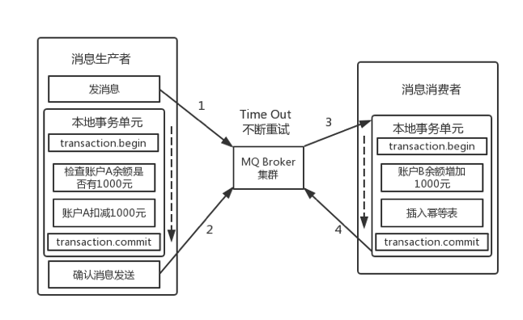
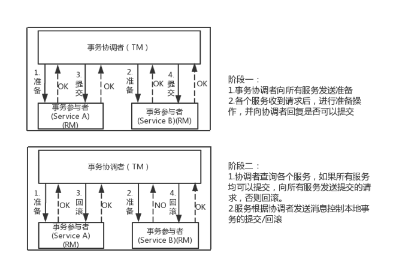

目前云计算、大数据、互联网领域的大部分系统都采用了SOA、微服务化的架构。一个涉及端到端全链路的业务操作往往会由多个服务和数据库实例共同完成。因此，在一致性要求较高的业务场景中，如何保证多个服务之间RPC调用后的数据一致将成为关键点。

一、分布式系统/SOA/微服务架构的特点：
在大型分布式系统中要同时能够满足，分布式一致性(Consistency)、可用性(Availability)和分区容忍性(Partitiontolerance)，是不存在的。在大多数情况下只能满足其中的2项，而实现系统的最终一致性(Base理论)。

( 1 ) CAP特点：
a.一致性(Consistency):( 同样数据在分布式系统的各个节点上都是一致的)

b.可用性(Availability):( 所有在分布式系统活跃的节点都能够处理操作且能响应查询)

c.分区容忍性(Partition Tolerance) :(如果出现了网络故障、一部分节点无法通信，但是系统仍能够工作)

( 2 ) ACID特点：
a.原子性(Atomicity)

一个事务(transaction)中的所有操作，要么全部完成，要么全部不完成，不会结束在中间某个环节。事务在执行过程中发生错误，会被回滚（Rollback）到事务开始前的状态，就像这个事务从来没有执行过一样。

b.一致性(Consistency)

事务的一致性指的是在一个事务执行之前和执行之后数据库都必须处于一致性状态。如果事务成功地完成，那么系统中所有变化将正确地应用，系统处于有效状态。如果在事务中出现错误，那么系统中的所有变化将自动地回滚，系统返回到原始状态。

c.隔离性(Isolation)

指的是在并发环境中，当不同的事务同时操纵相同的数据时，每个事务都有各自的完整数据空间。由并发事务所做的修改必须与任何其他并发事务所做的修改隔离。事务查看数据更新时，数据所处的状态要么是另一事务修改它之前的状态，要么是另一事务修改它之后的状态，事务不会查看到中间状态的数据。

d.持久性(Durability)

指的是只要事务成功结束，它对数据库所做的更新就必须永久保存下来。即使发生系统崩溃，重新启动数据库系统后，数据库还能恢复到事务成功结束时的状态。

二、分布式事务的基本介绍
分布式事务服务（Distributed Transaction Service，DTS）是一种分布式事务框架，用来确保在大规模分布式/微服务环境下端到端业务操作的最终一致性。

由CAP定理可知，任何大型的分布式系统/微服务在一致性、可用性和分区容忍这三点上只能保证其中的两点。由于在分布式系统中经常发生丢包、网络故障，分区容忍性是必须要满足的，同时为了兼顾高可用性，绝大部分系统都将强一致性需求转化成最终一致性的需求，并通过幂等机制保证了数据的最终一致性。

三、常用的分布式技术介绍
( 1 ) 本地消息表（经典的ebay模式）
该方案的核心思想在于分布式系统在处理任务时通过消息日志的方式来异步执行。消息日志可以存储至本地文本、数据库或消息队列，然后再通过业务规则定时任务或人工自动重试。以在线支付系统的跨行转账为例：

第一步，伪代码如下，对用户id为A的账户扣款1000元，通过本地事务将事务消息(包括本地事务id、支付账户、收款账户、金额、状态等)插入至消息表：

Begin transaction
 
         update user_account set amount = amount - 1000 where userId = 'A'
 
         insert into trans_message(xid,payAccount,recAccount,amount,status) values(uuid(),'A','B',1000,1);
 
end transaction
 
commit;
第二步，通知对方用户id为B，增加1000元，通常通过消息MQ的方式发送异步消息，对方订阅并监听消息后自动触发转账的操作；这里为了保证幂等性，防止触发重复的转账操作，需要在执行转账操作方新增一个trans_recv_log表用来做幂等，在第二阶段收到消息后，通过判断trans_recv_log表来检测相关记录是否被执行，如果未被执行则会对B账户余额执行加1000元的操作，并会将该记录增加至trans_recv_log,事件结束后通过回调更新trans_message的状态值。

( 2 ) 消息中间件
a.非事务消息中间件

这里仍然以上面跨行转账为例，我们很难保证在扣款完成之后对MQ投递消息的操作就一定能成功。这样一致性似乎很难保证。以下伪代码说明了消息投递的异常：

try{
 
    boolean result = dao.update(model);//更新数据库失败抛出异常
 
    if(result){
 
                      mq.send(model);//如果MQ超时或者接收方处理失败,抛出异常
 
    }
 
}catch(Exception ex){
 
                          rollback();//如果异常回滚
 
}
对于以上的运行情况主要有以下几种：

操作数据库成功，向MQ中投递消息也成功，该属于正常情况，一切都OK。
操作数据库失败，不会向MQ中投递消息了。
操作数据库成功，但是向MQ中投递消息时失败，向外抛出了异常，刚刚执行的更新数据库的操作将被回滚。
从上面分析的几种情况来看，基本上能确保,发送消息的可靠性。我们再来分析下消费者端的问题：

接收者取出消息后，消费者对应的业务操作要执行成功。如果业务执行失败，消息不能失效或者丢失。需要保证消息与业务操作一致。
尽量确保消息的幂等性。如果出现重复消息投递，能够进行幂等而不对业务产生影响。
b.支持事务的消息中间件

Apache开源的RocketMQ中间件能够支持一种事务消息机制，确保本地操作和发送消息的异步处理达到本地事务的结果一致。

第一阶段，RocketMQ在执行本地事务之前，会先发送一个Prepared消息，并且会持有这个消息的接口回查地址。

第二阶段，执行本地事物操作。

第三阶段，确认消息发送，通过第一阶段拿到的接口地址URL执行回查，并修改状态，如果本地事务成功，则修改状态为已提交，否则修改状态为已回滚。

其中，如果第三阶段的确认消息发送失败后，RocketMQ会有定时任务扫描集群中的事务消息，如果发现还是处于prepare状态的消息，它会向消息发送者确认本地事务是否已执行成功。RocketMQ会根据发送端设置的策略来决定是回滚还是继续发送确认消息。这样就保证了消息的发送与本地事务同时成功或同时失败。

再回到上面转账的例子，如果用户A的账户余额已经减少，且消息已经发送成功，作为消费者用户B开始消费这条消息，这个时候就会出现消费失败和消费超时两个问题，解决超时问题的思路就是一直重试，直到消费端消费消息成功，整个过程中有可能会出现消息重复的问题，就需要采用前面说的幂等方案来进行处理。

分布式事务—2PC协议
为了解决大型分布式/微服务系统中的一致性问题，业界比较流行的做法是采用比较著名的有二阶提交协议（2 Phase Commitment Protocol）和三阶提交协议（3 PhaseCommitment Protocol）。考虑到性能问题，三阶段提交协议目前较少被采用。本文也主要介绍二阶段协议。

2PC协议
二阶段提交协议是分布式系统中较为经典的处理数据一致性的解决方案。在大型的集群环境中，对于单体微服务本身而言虽然能够通过代码质量、Mock测试等方法来确保自身服务的可用性，但是无法能够保证其他服务的可用性。当一个全链路的端到端业务操作，常常会跨多个节点、多个应用，为了能够保证全局事务的ACID特性，需要引入一个协调组件(这里称之为TM)来控制所有服务参与者(这里称之为RM)的操作结果，根据所有参与者的反馈结果来决定整个分布式事务究竟是提交还是回滚的结果。

第一阶段：称为准备(prepare)阶段。事务协调者向各个服务应用发送prepare请求，服务应用在得到请求后做预处理操作，预处理可能是做预检查，也可能是把请求临时存储，可以理解为是一种试探性地提交。下面是一般的步骤：

a.事务协调者会问所有的参与者服务，是否可以提交操作。

b.各个参与者开始事务执行的准备工作：如资源上锁，预留资源，写回滚/重试的log。

c.参与者响应协调者，如果事务准备工作成功，则回应“可以提交”，否则回应拒绝提交。

第二阶段：称为提交(commit)/回滚(rollback)阶段。是指事务真正提交或者回滚的阶段。如果事务协调者发现事务参与者有一个在prepare阶段出现失败，则会要求所有的参与者进行回滚。如果协调者发现所有的参与者都prepare操作都是成功，那么他将向所有的参与者发出提交请求，这时所有参与者才会正式提交。由此保证了要求全部提交成功，要么全部失败。下面是具体步骤：

a.如果所有的参与者都回应“可以提交”，那么协调者向所有参与者发送“正式提交”的命令。参与者完成正式提交，并释放所有资源，然后回应“完成”，协调者收集各个服务的“完成”回应后结束事务。

b.如果有一个参与者回应“拒绝提交”，那么协调者向所有的参与者发送“回滚操作”，并释放所有的资源，然后回应“回滚完成”，协调者收集各个服务应用的“回滚”返回后，取消整体的分布式事务。

下图为二阶段的成功和失败示例图：

二阶段提交协议解决的是分布式系统/微服务架构中数据强一致性的问题，其原理简单，但缺点也是存在，主要缺点如下：

a.单点问题：协调者在整个二阶段中的作用非常重要，一旦部署协调者组件服务的节点出现不可用宕机情况，那么会影响整个分布式系统的正常运行。

b.同步阻塞：二阶段提交执行过程中，所有服务参与者需要服从协调者的统一调度，期间处于阻塞状态，会一定程度上影响整个系统的效率。